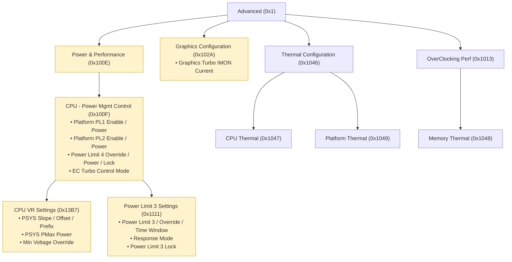
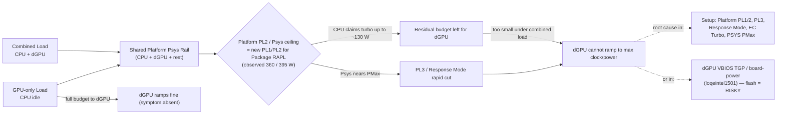

# BIOS Setup IFR Read-Only Investigation — Deliverables

**Machine:** Lenovo LOQ Essential 15IRX11 (Type 83SC) · i5-13450HX · NVIDIA RTX 5050 · BIOS SECN22WW
**Goal:** Map the Insyde H2O Setup tree to find settings that starve the dGPU under combined
CPU+GPU load (GPU-only is fine).
**Mode:** Strictly read-only. No SPI write, no flash, no setting changes. CFG Lock & Overclocking
Lock noted as Enabled (cross-reference only).

## Pipeline (how the data was obtained)
1. Vendor BIOS image `secn22ww.exe` (13.76 MB, matches running SECN22WW) downloaded from
   download.lenovo.com; 7-Zip extracted → `signed_SE.ROM` (21,262,952 B).
2. Whole-image IFRExtractor found only tiny AbtSetup; main Setup is LZMA-packed.
3. UEFIExtract failed (Error 35) on the nested LZMA GUID volume
   (`EE4E5898-3914-4259-9D6E-DC7BD79403CF`); decompressed manually (LZMA FORMAT_ALONE) →
   `lzma_g4_c0_s4642141.bin` (27,865,088 B, contains "Advanced" + "PL4" = main DXE volume).
4. IFRExtractor-RS on that volume → the canonical full Setup tree
   `lzma_g4_c0_s4642141.bin.28.78.en-US.uefi.ifr.txt` (FormSet `C6D4769E…`, 166 forms,
   4,418 leaf controls). This is the primary source for everything below.

## Files in this folder
| File | What it is |
|------|------------|
| `raw_ifr_Advanced_FormSet.txt` | Raw extracted IFR of the full Advanced/Setup tree (authoritative reference). 1.8 MB. |
| `structured_map.md` | Full hierarchical map: FormSet → Form → leaf control (type, VarStore, offset, QID, options, help). 770 KB. |
| `power_flags.md` | Every leaf control matching power/thermal/GPU keywords (673 entries). |
| `focused_power_settings.md` | High-signal subset (103 entries): Platform PLx, Psys/Pmax, PL3/PL4, EC Turbo, Response Mode, Graphics IMON, C-States. |
| `HYPOTHESIS.md` | Ranked hypotheses + safe/risky split + read-only verification steps. **Start here for analysis.** |
| `setup_tree_ascii.txt` | Full text/ASCII navigation tree **with every option's description** (all 166 forms + 4,240 settings). 786 KB. |
| `setup_tree.html` | **Interactive applet** (self-contained, no dependencies). Collapsible tree + search; click/hover a setting to see its full description, options and VarStore offset. Open in any browser. |
| `setup_tree.json` | Raw tree data (forms → settings → help/offset/options) consumed by the applet. |
| `setup_nav.mmd` | Mermaid diagram: power/thermal subtree (forms + key settings). Renders on GitHub. |
| `power_signal_flow.mmd` | Mermaid diagram: causal chain of the dGPU-under-combined-load bug. Renders on GitHub. |

> GitHub renders ```` ```mermaid ```` code blocks inline — paste the `.mmd` contents into a
> ```` ```mermaid ```` fence in your README.

## Graphical: power/thermal navigation subtree


## Graphical: causal chain of the bug


## Interactive applet (local + GitHub Pages)
`setup_tree.html` is a standalone, dependency-free page. **Open it directly in a browser** to
explore the full tree with descriptions. To embed it on a GitHub README as a live applet, enable
**GitHub Pages** for the repo (root / `docs`) and link/iframe the HTML — GitHub's markdown renderer
shows the raw `.html` source, not the executed page. The Mermaid `.mmd` diagrams above render
inline on GitHub without any extra setup.

## Official graphical BIOS tool (reference)
**Lenovo BIOS Simulator Center** — https://download.lenovo.com/bsco/ — a free, interactive,
graphical UEFI BIOS simulator from Lenovo (supports 1,000+ Lenovo/Think models, searchable by
model). It recreates the actual BIOS UI (Graphics or Text mode) so you can click through every
menu without touching a real machine. Tip: open it and search **"83SC"** or **"LOQ"** to see the
real LOQ Essential 15IRX11 Setup screens — a great complement to the IFR dump above. (Coverage of
this exact machine wasn't programmatically confirmed here; verify via the simulator's search box.)

## Quick read-order
1. `HYPOTHESIS.md` — the answer (ranked H1–H6 + safe/risky split).
2. `power_signal_flow.mmd` (diagram above) — the mechanism in one picture.
3. `focused_power_settings.md` — the exact knobs + IFR help text.
4. `structured_map.md` / `raw_ifr_Advanced_FormSet.txt` — drill down.
