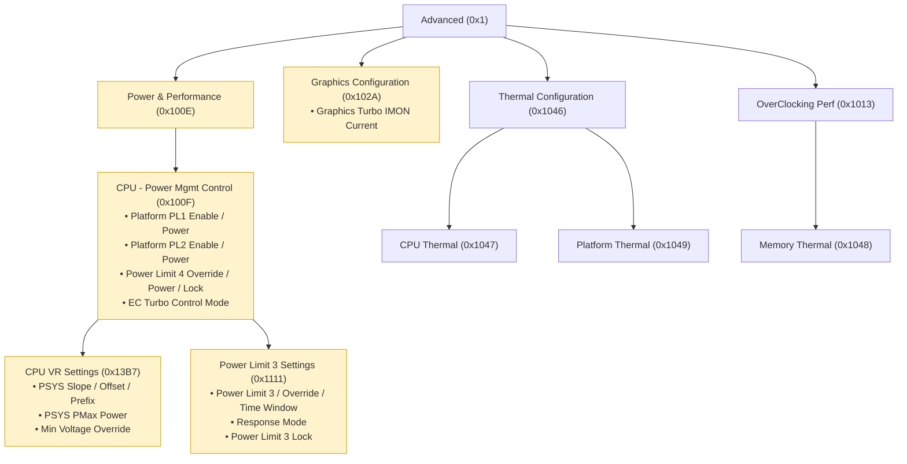
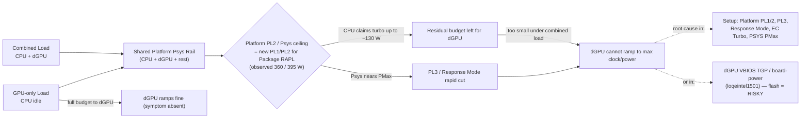

# Lenovo LOQ Essential 15IRX11 — Advanced BIOS Unlock

**Machine:** Lenovo LOQ Essential 15IRX11 (Type 83SC) · i5-13450HX · NVIDIA RTX 5050  
**BIOS:** SECN22WW · **SREP:** 0.1.4c  
**Status:** WORKING — Advanced tab visible in native F2 BIOS setup  
**Method:** SREP (Smokeless Runtime EFI Patcher) driver + Config G (memory-only patch, no flash)

---

> [!WARNING]
> **The Advanced BIOS menu can brick your system.** Modifying settings incorrectly may cause permanent hardware damage, data loss, or render your machine unbootable.
> 
> **Use at your own risk.** If you choose to ignore these warnings and damage your system, it is your responsibility, not mine.

---

## How to Reproduce

### Prerequisites
- A FAT32-formatted USB drive (any size, 1GB+ is fine)
- This repository cloned or downloaded
- A Windows PC to prepare the USB

### Step 1: Prepare the USB

On your Windows PC, format a USB drive as FAT32 (Quick Format is fine).

Then copy these 3 files from this repo to the USB:

| From (in this repo)                        | To (on USB)                |
|--------------------------------------------|----------------------------|
| `BOOTABLE DEVICE\EFI\Boot\BOOTX64.efi`    | `USB:\EFI\Boot\BOOTX64.efi`    |
| `BOOTABLE DEVICE\EFI\Boot\BOOTX64_SHELL.efi` | `USB:\EFI\Boot\BOOTX64_SHELL.efi` |
| `BOOTABLE DEVICE\SREP_Config.cfg`          | `USB:\SREP_Config.cfg`          |

The USB should look like:

```
USB:\
  SREP_Config.cfg                      (660 bytes)
  EFI\
    Boot\
      BOOTX64.efi                      (16,704 bytes)
      BOOTX64_SHELL.efi                (1,137,728 bytes)
```

That is ALL you need. Three files. Nothing else.

### Step 2: Boot from USB
1. Plug the USB into the LOQ 15IRX11.
2. Power on and immediately spam **F12** to enter the Boot Menu.
3. Select your USB drive from the boot list.
4. The system will boot into the SREP driver, which patches the BIOS form-set visibility flags in memory, then hands off to Windows.

### Step 3: Verify Unlock
After Windows boots:
1. Restart the computer.
2. Spam **F2** during POST to enter BIOS Setup.
3. The **"Advanced"** tab should now be visible in the BIOS menu.

If it is there, you are done. The unlock is active.

### Step 4: Make It Persist Without USB (one-time setup)

After confirming the unlock works with USB plugged in, you can register SREP as a DXE driver on the internal EFI System Partition (ESP) so you no longer need the USB.

**4a.** From Windows, open PowerShell as Administrator and run:

```powershell
mountvol S: /s
mkdir S:\EFI\SREP
copy "BOOTABLE DEVICE\EFI\Boot\BOOTX64.efi" S:\EFI\SREP\BOOTX64.efi
copy "BOOTABLE DEVICE\SREP_Config.cfg" S:\SREP_Config.cfg
copy "BOOTABLE DEVICE\SREP_Config.cfg" S:\EFI\SREP\SREP_Config.cfg
mountvol S: /d
```

**4b.** Register the driver from UEFI Shell:

1. Plug the USB back in (it has the UEFI Shell on it).
2. Reboot, spam F12, select USB from boot menu.
3. When the UEFI Shell loads, type:

```
map -r
```

4. Find the `fsX:` that maps to your internal ESP (look for the one containing `\EFI\SREP\`). Usually `fs1:` or `fs2:`.
5. Run:

```
bcfg driver add 0 fsX:\EFI\SREP\BOOTX64.efi "SREP-Patch"
```

(Replace X with the actual number)

6. Verify with:

```
bcfg driver dump
```

7. Type `exit`, remove USB, reboot.

**4c.** After this, SREP runs automatically from the internal ESP at every boot. You no longer need the USB. Press F2 at POST and the Advanced tab is there.

---

## Quick Reference

```
USB files needed:
  EFI\Boot\BOOTX64.efi        (SREP loader)
  EFI\Boot\BOOTX64_SHELL.efi  (UEFI Shell for F12)
  SREP_Config.cfg              (Config G — the working config)

Boot from USB → patches applied → Advanced visible in F2 BIOS.

ESP persistence:
  mountvol S: /s
  mkdir S:\EFI\SREP
  copy BOOTX64.efi S:\EFI\SREP\
  copy SREP_Config.cfg S:\EFI\SREP\
  copy SREP_Config.cfg S:\
  mountvol S: /d
  # Then from UEFI Shell:
  bcfg driver add 0 fsX:\EFI\SREP\BOOTX64.efi "SREP-Patch"
```

---

## Recovery (undo everything)

**Option 1 — Instant:** Unplug USB → reboot → Advanced hidden.  
(Your NVRAM settings are still saved, just invisible.)

**Option 2 — Shell:** Boot USB → F12 → Shell → `bcfg driver rm 0`

**Option 3 — ESP:** Boot USB → Shell →
```
mountvol S: /s
cd S:\EFI\SREP
del BOOTX64.efi
del SREP_Config.cfg
cd ..
rmdir SREP
bcfg driver rm 0
```

**Option 4 — Nuclear:** Enter F2 → Load Defaults → Save & Exit.  
(Clears all NVRAM settings, SREP stays registered if driver entry still exists.)

---

## Technical Details

### Mechanism

SREP is a UEFI DXE application that runs before the BIOS setup UI. It patches runtime flags in H2OFormBrowserDxe's form-set visibility table, flipping "isShown" bytes from `0x00` (hidden) to `0x0[...]

The patch is **MEMORY-ONLY** — no flash modification occurs. Each boot, SREP re-applies the patches from scratch via the config file.

Config G = Original 6-pattern config MINUS `Op Exec`. The `Op LoadFromFV SetupUtilityApp` trigger is what causes SREP to load H2OFormBrowserDxe into memory, making the form-set table available fo[...]

### What Persists

| Setting | Persists? |
|---------|-----------|
| NVRAM settings saved in Advanced BIOS menus | **YES** — stored in standard UEFI NVRAM variables (Setup, SetupCpuFeatures, PchSetup, etc.) |
| Advanced menu visibility | **NO** — must be re-patched every boot by SREP running as a DXE driver |

### Config G Contents (SREP_Config.cfg)

```
Op Loaded
H2OFormBrowserDxe
Op Patch
Pattern
59B963B8C60E334099C18FD89F04022200000000
59B963B8C60E334099C18FD89F04022201000000
Op Patch
Pattern
E33545B0043046499EB714942898305300000000
E33545B0043046499EB714942898305301000000
Op Patch
Pattern
732871A65F92C64690B4A40F86A0917B00000000
732871A65F92C64690B4A40F86A0917B01000000
Op Patch
Pattern
9E76D4C6487F2A4D98E987ADCCF35CCC00000000
9E76D4C6487F2A4D98E987ADCCF35CCC01000000
Op Patch
Pattern
49D592C3EB27464F8A119F5DF55A9C8B00000000
49D592C3EB27464F8A119F5DF55A9C8B01000000
Op Patch
Pattern
1AB0E0C17E60754BB8BB0631ECFAACF200000000
1AB0E0C17E60754BB8BB0631ECFAACF201000000
Op End

Op LoadFromFV
SetupUtilityApp
```

### Key NVRAM Variables (Advanced settings)

| VarStoreId | Name              | GUID                                | Size  |
|------------|-------------------|-------------------------------------|-------|
| 0x1        | Setup             | EC87D643-EBA4-4BB5-A1E5-...       | 0xBAD |
| 0x1234     | SystemConfig      | A04A27F4-DF00-4D42-B552-...       | 0x4B0 |
| 0x1233     | AdvanceConfig     | A04A27F4-DF00-4D42-B552-...       | 0x8   |
| 0x100C     | SetupCpuFeatures  | EC87D643-EBA4-4BB5-A1E5-...       | 0x39  |
| 0x2        | SaSetup           | 72C5E28C-7783-43A1-8767-...       | 0x578 |
| 0x3        | CpuSetup          | B08F97FF-E6E8-4193-A997-...       | 0x3C1 |
| 0x5        | PchSetup          | 4570B7F1-ADE8-4943-8DC3-...       | 0x80F |
| 0x4        | MeSetup           | 5432122D-D034-49D2-A6DE-...       | 0x36  |

**SuppressIf Gate:** OverClocking Performance Menu is hidden when `SetupCpuFeatures[0x30] == 0x00`. Set to `0x01` to show OC menu.

---

## IFR / BIOS Menu Analysis

This section documents the full IFR (Internal Forms Representation) analysis of the Advanced BIOS setup tree, used to identify settings that may affect dGPU power under combined CPU+GPU load.

### Pipeline (how the data was obtained)
1. Vendor BIOS image `secn22ww.exe` (13.76 MB, matches running SECN22WW) downloaded from download.lenovo.com; 7-Zip extracted -> `signed_SE.ROM` (21,262,952 B).
2. Whole-image IFRExtractor found only tiny AbtSetup; main Setup is LZMA-packed.
3. UEFIExtract failed (Error 35) on the nested LZMA GUID volume (`EE4E5898-3914-4259-9D6E-DC7BD79403CF`); decompressed manually (LZMA FORMAT_ALONE) -> `lzma_g4_c0_s4642141.bin` (27,865,088 B, con[...]
4. IFRExtractor-RS on that volume -> the canonical full Setup tree `lzma_g4_c0_s4642141.bin.28.78.en-US.uefi.ifr.txt` (FormSet `C6D4769E...`, 166 forms, 4,418 leaf controls). This is the primary [...]

### MAP Files

| File | Description |
|------|-------------|
| `raw_ifr_Advanced_FormSet.txt` | Raw extracted IFR of the full Advanced/Setup tree (authoritative reference). 1.8 MB. |
| `structured_map.md` | Full hierarchical map: FormSet -> Form -> leaf control (type, VarStore, offset, QID, options, help). 770 KB. |
| `power_flags.md` | Every leaf control matching power/thermal/GPU keywords (673 entries). |
| `focused_power_settings.md` | High-signal subset (103 entries): Platform PLx, Psys/Pmax, PL3/PL4, EC Turbo, Response Mode, Graphics IMON, C-States. |
| `HYPOTHESIS.md` | Ranked hypotheses + safe/risky split + read-only verification steps. **Start here for analysis.** |
| `setup_tree_ascii.txt` | Full text/ASCII navigation tree with every option's description (all 166 forms + 4,240 settings). 786 KB. |
| `setup_tree.html` | Interactive applet (self-contained, no dependencies). Collapsible tree + search; click/hover a setting to see its full description, options and VarStore offset. Open in any [...]
| `setup_tree.json` | Raw tree data (forms -> settings -> help/offset/options) consumed by the applet. |
| `setup_nav.mmd` | Mermaid diagram: power/thermal subtree (forms + key settings). Renders on GitHub. |
| `power_signal_flow.mmd` | Mermaid diagram: causal chain of the dGPU-under-combined-load bug. Renders on GitHub. |

### Recommended Read Order
1. `HYPOTHESIS.md` — the answer (ranked H1-H6 + safe/risky split).
2. `power_signal_flow.mmd` (diagram below) — the mechanism in one picture.
3. `focused_power_settings.md` — the exact knobs + IFR help text.
4. `structured_map.md` / `raw_ifr_Advanced_FormSet.txt` — drill down.

### Graphical: Power/Thermal Navigation Subtree



### Graphical: Causal Chain of the dGPU Bug



### Interactive Applet

`setup_tree.html` is a standalone, dependency-free page. **Open it directly in a browser** to explore the full tree with descriptions. To embed it on a GitHub README as a live applet, enable **Gi[...]

### Official Graphical BIOS Tool (Reference)

**Lenovo BIOS Simulator Center** — https://download.lenovo.com/bsco/ — a free, interactive, graphical UEFI BIOS simulator from Lenovo (supports 1,000+ Lenovo/Think models, searchable by model[...]

---

## Repository Contents

```
BOOTABLE DEVICE\
  EFI\Boot\BOOTX64.efi            SREP loader (the file you need)
  EFI\Boot\BOOTX64_SHELL.efi      UEFI Shell v2.2 (for F12 boot)
  EFI\Boot\BOOTX64_SREP.efi       SREP loader backup
  EFI\Boot\BOOTX64_UMAF.efi       UMAF loader (not needed)
  SREP_Config.cfg                  Config G (the working config)
  SREP_Config_G_WORKING.cfg       Backup of working config
  UNLOCK_README.txt                Quick-start guide
  logs\                            Boot logs + NVRAM dumps
  tools\                           Analysis tools, ROM, scripts
  umaf\                            UMAF payload (not needed)

tools\ contains:
  signed_SE.ROM                    Official BIOS image (keep for
                                   future BIOS updates — re-extract
                                   H2OFormBrowserDxe to find new
                                   patterns if Lenovo changes them)
  secn22ww.exe                     Original BIOS update executable
  make_cfg.ps1                     SREP config generator
  *.py                             Analysis scripts for pattern
                                   extraction from new ROMs
  ifrextract-rs\ifrextractor.exe   IFR extraction tool

MAP\ contains:
  raw_ifr_Advanced_FormSet.txt     Full IFR dump of Advanced menu
  structured_map.md                Human-readable form-set map
  focused_power_settings.md        Power/thermal setting offsets
  power_flags.md                   Complete variable reference
  HYPOTHESIS.md                    Reverse engineering notes
  setup_tree.html                  Interactive browser applet
  setup_tree_ascii.txt             Full ASCII navigation tree
  setup_tree.json                  Applet data
  setup_nav.mmd                    Power/thermal Mermaid diagram
  power_signal_flow.mmd            Bug causal chain Mermaid diagram
```

---

Generated: 2026-08-30  
Machine: Lenovo LOQ Essential 15IRX11 (model_secn, Type 83SC)  
BIOS: SECN22WW  
SREP: 0.1.4c
